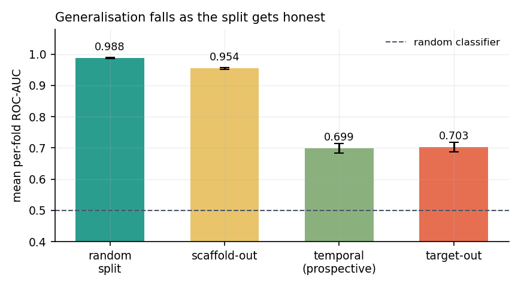
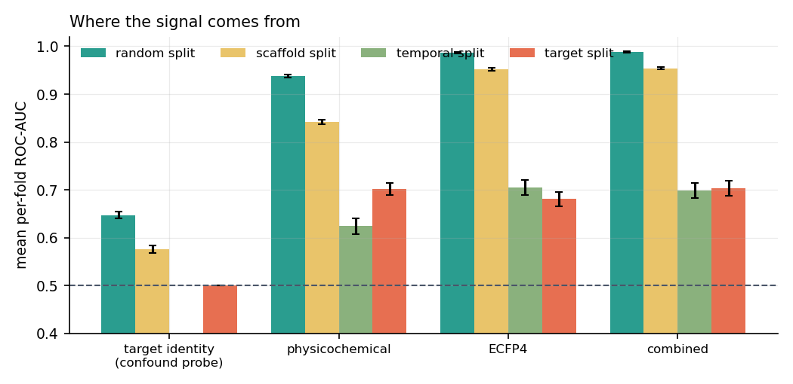
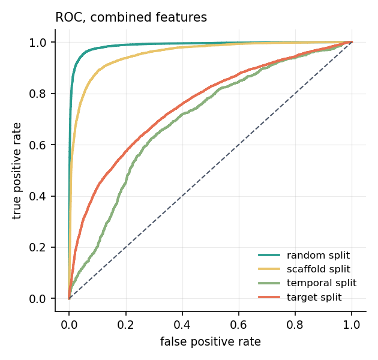
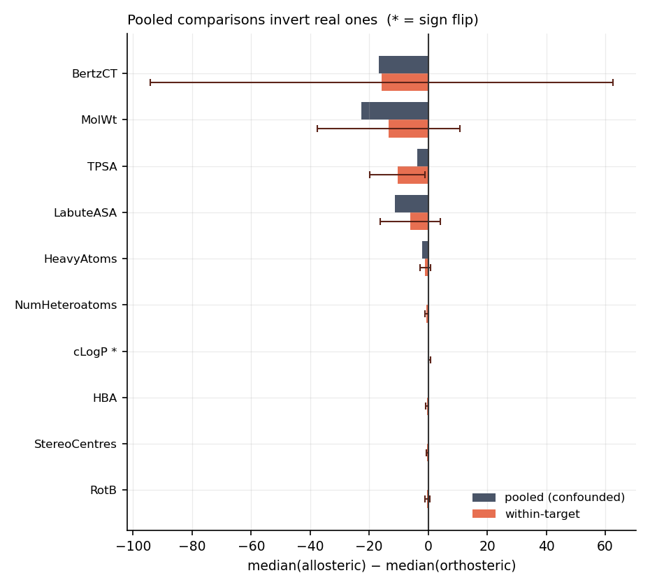
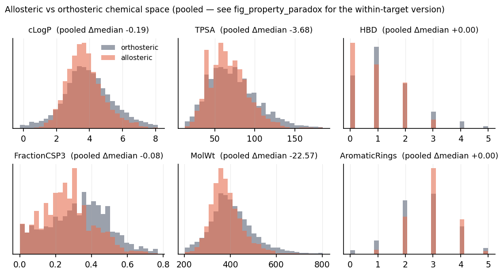
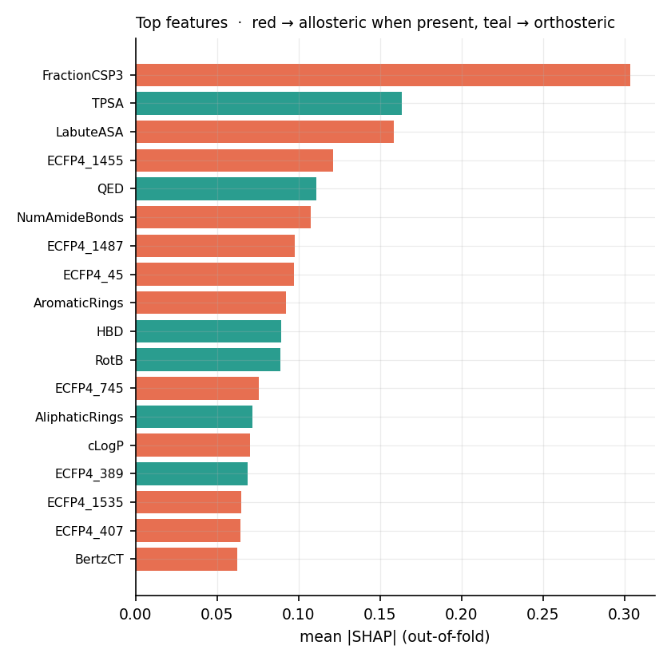
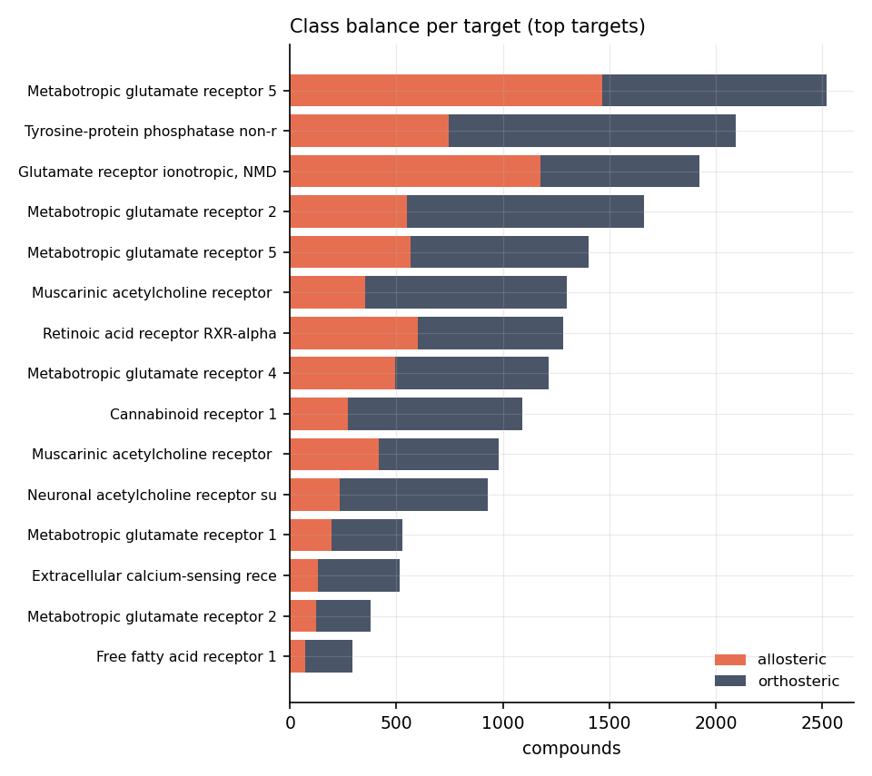

# Results — allosteric vs orthosteric modulator classification

*ChEMBL 37 · strict + weak negatives, capped at 3x positives per target · benchmark run in 3113s on node5 (Linux x86_64, 24 cores)*

## Dataset

- **24,177 compounds** — 9,327 allosteric, 14,850 orthosteric (38.6% positive)
- **85 targets**, each carrying at least 5 compounds of *both* classes
- **5,403 generic Bemis–Murcko scaffolds**

Label tiers:

| tier               |   compounds |
|:-------------------|------------:|
| orthosteric_weak   |       14332 |
| allosteric         |        9327 |
| orthosteric_strict |         518 |

## Benchmark

**Mean per-fold ROC-AUC**, with a 95% bootstrap CI resampled *within* folds, plus the spread across folds. Metrics are computed inside each fold and then averaged: pooling out-of-fold predictions into a single ROC compares scores from models that never shared a scale (see *Pooling artefact*).

`target identity` uses only a one-hot of the primary target and carries no chemistry — it measures how much of the task is a target look-up.

| split    | features    | model    | fold ROC-AUC [95% CI]   |   fold SD |   pooled |    MCC |     n |
|:---------|:------------|:---------|:------------------------|----------:|---------:|-------:|------:|
| random   | target_only | logistic | 0.647 [0.640–0.655]     |     0.012 |    0.646 |  0.237 | 24177 |
| random   | physchem    | lightgbm | 0.938 [0.935–0.941]     |     0.003 |    0.938 |  0.719 | 24177 |
| random   | physchem    | logistic | 0.728 [0.722–0.735]     |     0.006 |    0.728 |  0.301 | 24177 |
| random   | ecfp        | lightgbm | 0.986 [0.985–0.988]     |     0.001 |    0.986 |  0.891 | 24177 |
| random   | ecfp        | logistic | 0.959 [0.957–0.961]     |     0.001 |    0.959 |  0.798 | 24177 |
| random   | combined    | lightgbm | 0.988 [0.986–0.989]     |     0.001 |    0.988 |  0.9   | 24177 |
| random   | combined    | logistic | 0.959 [0.957–0.962]     |     0.001 |    0.959 |  0.801 | 24177 |
| scaffold | target_only | logistic | 0.576 [0.568–0.583]     |     0.072 |    0.561 |  0.155 | 24177 |
| scaffold | physchem    | lightgbm | 0.842 [0.837–0.847]     |     0.014 |    0.841 |  0.514 | 24177 |
| scaffold | physchem    | logistic | 0.709 [0.702–0.715]     |     0.023 |    0.706 |  0.287 | 24177 |
| scaffold | ecfp        | lightgbm | 0.952 [0.949–0.954]     |     0.005 |    0.952 |  0.768 | 24177 |
| scaffold | ecfp        | logistic | 0.900 [0.896–0.904]     |     0.008 |    0.9   |  0.642 | 24177 |
| scaffold | combined    | lightgbm | 0.954 [0.951–0.957]     |     0.006 |    0.954 |  0.78  | 24177 |
| scaffold | combined    | logistic | 0.901 [0.897–0.905]     |     0.008 |    0.901 |  0.645 | 24177 |
| temporal | target_only | logistic | 0.317 [0.302–0.334]     |     0     |    0.317 | -0.272 |  4697 |
| temporal | physchem    | lightgbm | 0.624 [0.607–0.640]     |     0     |    0.624 |  0.164 |  4697 |
| temporal | physchem    | logistic | 0.596 [0.580–0.613]     |     0     |    0.596 |  0.122 |  4697 |
| temporal | ecfp        | lightgbm | 0.704 [0.689–0.720]     |     0     |    0.704 |  0.303 |  4697 |
| temporal | ecfp        | logistic | 0.640 [0.624–0.656]     |     0     |    0.64  |  0.181 |  4697 |
| temporal | combined    | lightgbm | 0.699 [0.683–0.714]     |     0     |    0.699 |  0.266 |  4697 |
| temporal | combined    | logistic | 0.650 [0.634–0.666]     |     0     |    0.65  |  0.186 |  4697 |
| target   | target_only | logistic | 0.500 [0.500–0.500]     |     0     |    0.499 |  0     | 24177 |
| target   | physchem    | lightgbm | 0.702 [0.689–0.715]     |     0.06  |    0.7   |  0.301 | 24177 |
| target   | physchem    | logistic | 0.643 [0.629–0.657]     |     0.063 |    0.643 |  0.225 | 24177 |
| target   | ecfp        | lightgbm | 0.681 [0.666–0.695]     |     0.139 |    0.735 |  0.353 | 24177 |
| target   | ecfp        | logistic | 0.648 [0.633–0.663]     |     0.085 |    0.676 |  0.27  | 24177 |
| target   | combined    | lightgbm | 0.703 [0.688–0.718]     |     0.135 |    0.755 |  0.384 | 24177 |
| target   | combined    | logistic | 0.660 [0.645–0.676]     |     0.078 |    0.685 |  0.283 | 24177 |

### Two uncertainties, not one

The bootstrap CI above resamples compounds *within* each fold, so it measures within-fold sampling noise: **0.703 [0.688–0.718]**. A claim about generalising to a *new target* must instead carry the spread between held-out target groups, which is much wider: per-fold AUCs [0.808, 0.8265, 0.4497, 0.7346, 0.6975], giving **0.703 [0.515–0.891]** (Student-t across 5 folds). The wider interval is the honest one for the headline claim.

### Pooling artefact

The target-identity probe is the worked example. Under the target-out split its one-hot features are all zero for a held-out target, so every prediction inside a fold is the same constant and the per-fold AUC is exactly **0.500** — chance, as it must be. Pooling those per-fold constants into one ROC instead reports **0.499**: an ordering invented between folds, not a below-chance model. Every headline number here is a fold-mean.

## Chemical space: pooled vs within-target

Median(allosteric) − median(orthosteric) for each property, computed two ways. **pooled** compares the two classes across the whole set and so confounds binding mode with which proteins each class came from. **within-target** averages the difference over targets that carry compounds of both classes, which is the only version that is about binding mode. A `sign_flip` is a Simpson's paradox: the pooled answer is the opposite of the real one.

| property       |   pooled Δ | within-target Δ [95% CI]   |   n_targets | flips   |
|:---------------|-----------:|:---------------------------|------------:|:--------|
| BertzCT        |     -16.65 | -15.78 [-94.10–+62.54]     |          85 |         |
| MolWt          |     -22.57 | -13.33 [-37.50–+10.84]     |          85 |         |
| TPSA           |      -3.68 | -10.41 [-19.73–-1.10]      |          85 |         |
| LabuteASA      |     -11.31 | -6.01 [-16.18–+4.16]       |          85 |         |
| HeavyAtoms     |      -2    | -1.04 [-2.82–+0.74]        |          85 |         |
| NumHeteroatoms |       0    | -0.55 [-1.21–+0.10]        |          85 |         |
| cLogP          |      -0.19 | +0.42 [+0.08–+0.75]        |          85 | **yes** |
| HBA            |       0    | -0.39 [-0.84–+0.06]        |          85 |         |
| StereoCentres  |       0    | -0.36 [-0.72–-0.01]        |          85 |         |
| RotB           |       0    | -0.32 [-1.07–+0.44]        |          85 |         |
| HBD            |       0    | -0.31 [-0.70–+0.08]        |          85 |         |
| AliphaticRings |       0    | -0.22 [-0.45–+0.01]        |          85 |         |

## Applicability domain

Maximum ECFP4 Tanimoto from each test compound to the training set. This is the measurement behind the split-scheme gap: a harder split is only harder because it moves test molecules further from what the model has seen.

| split    |   median_nn_tanimoto |   mean_nn_tanimoto |   frac_above_0.7 |   frac_above_0.4 |   n_test_compounds |
|:---------|---------------------:|-------------------:|-----------------:|-----------------:|-------------------:|
| random   |             0.779661 |           0.752767 |         0.74149  |         0.959466 |              24177 |
| scaffold |             0.647059 |           0.630291 |         0.333747 |         0.905075 |              24177 |
| temporal |             0.438202 |           0.477752 |         0.114967 |         0.616777 |               4697 |
| target   |             0.365079 |           0.421355 |         0.094015 |         0.397113 |              24177 |

## Head-to-head (paired bootstrap on identical resamples)

Differences between fold-mean AUCs, bootstrapped within folds on identical resamples for both models.

| split    | question                         | Δ fold ROC-AUC [95% CI]   |   p_two_sided | significant   |
|:---------|:---------------------------------|:--------------------------|--------------:|:--------------|
| random   | structure beyond physchem        | +0.050 [+0.047–+0.053]    |         0     | **yes**       |
| random   | chemistry beyond target identity | +0.341 [+0.333–+0.348]    |         0     | **yes**       |
| random   | fingerprint beyond physchem      | +0.049 [+0.046–+0.051]    |         0     | **yes**       |
| scaffold | structure beyond physchem        | +0.112 [+0.108–+0.116]    |         0     | **yes**       |
| scaffold | chemistry beyond target identity | +0.379 [+0.371–+0.386]    |         0     | **yes**       |
| scaffold | fingerprint beyond physchem      | +0.110 [+0.105–+0.114]    |         0     | **yes**       |
| temporal | structure beyond physchem        | +0.075 [+0.059–+0.090]    |         0     | **yes**       |
| temporal | chemistry beyond target identity | +0.381 [+0.363–+0.399]    |         0     | **yes**       |
| temporal | fingerprint beyond physchem      | +0.080 [+0.062–+0.098]    |         0     | **yes**       |
| target   | structure beyond physchem        | +0.002 [-0.011–+0.014]    |         0.798 | no            |
| target   | fingerprint beyond physchem      | -0.021 [-0.035–-0.007]    |         0.005 | **yes**       |

## What the model keys on

Mean |SHAP| over out-of-fold rows under the target-out split.

`direction` is the mean signed SHAP over molecules where the feature is actually **present** — averaging over all rows would describe the feature being absent and inverts the sign for rare bits.

| feature        |   mean_abs_shap |   mean_signed_shap_when_present |   n_molecules_with_feature | direction      |
|:---------------|----------------:|--------------------------------:|---------------------------:|:---------------|
| FractionCSP3   |       0.303454  |                     0.0148857   |                      23316 | -> allosteric  |
| TPSA           |       0.16311   |                    -0.00983923  |                      24174 | -> orthosteric |
| LabuteASA      |       0.158364  |                     0.00481421  |                      24177 | -> allosteric  |
| ECFP4_1455     |       0.121262  |                     0.425023    |                       2104 | -> allosteric  |
| QED            |       0.110705  |                    -0.000770961 |                      24177 | -> orthosteric |
| NumAmideBonds  |       0.107403  |                     0.111341    |                      12113 | -> allosteric  |
| ECFP4_1487     |       0.0975717 |                     0.275761    |                       2953 | -> allosteric  |
| ECFP4_45       |       0.0969128 |                     0.267821    |                       2638 | -> allosteric  |
| AromaticRings  |       0.0924701 |                     0.00351179  |                      23788 | -> allosteric  |
| HBD            |       0.0894139 |                    -0.0566922   |                      16523 | -> orthosteric |
| RotB           |       0.088695  |                    -0.00386251  |                      23823 | -> orthosteric |
| ECFP4_745      |       0.0758185 |                     0.362977    |                       2626 | -> allosteric  |
| AliphaticRings |       0.0714656 |                    -0.0235578   |                      16543 | -> orthosteric |
| cLogP          |       0.0702829 |                     0.00896139  |                      23878 | -> allosteric  |
| ECFP4_389      |       0.068528  |                    -0.114255    |                       6736 | -> orthosteric |
| ECFP4_1535     |       0.0647285 |                     0.0765765   |                       7807 | -> allosteric  |
| ECFP4_407      |       0.0641255 |                     0.229753    |                       3855 | -> allosteric  |
| BertzCT        |       0.0622665 |                     0.00149836  |                      24177 | -> allosteric  |
| ECFP4_724      |       0.0615276 |                     0.392053    |                       1990 | -> allosteric  |
| ECFP4_807      |       0.0609986 |                    -0.0481478   |                      14719 | -> orthosteric |

Top ECFP4 bits, class prevalence:

|   bit |   frac_in_allosteric |   frac_in_orthosteric |   enrichment |   n_molecules | example_smiles                                         | example_substructures            |
|------:|---------------------:|----------------------:|-------------:|--------------:|:-------------------------------------------------------|:---------------------------------|
|  1455 |             0.17905  |             0.0292256 |     6.12648  |          2104 | O=C(Cn1cc(S(=O)(=O)Cc2ccc(F)cc2)c2ccccc21)NCc1ccccc1Cl | cn(c)C; cn(C)c(=O)c(n)N; cn(-c)n |
|  1487 |             0.218291 |             0.0617508 |     3.53503  |          2953 | COc1cccc(-c2cc(-n3cc(CNCC4CCCCC4)c4ccc(F)cc43)ccn2)c1  | ccc(F)cc; CN(C)C; ccc(F)cc       |
|    45 |             0.184196 |             0.0619529 |     2.97317  |          2638 | COc1cccc(-c2cccc(-n3cc(CNCC4CCCCC4)c4ccccc43)c2)c1     | cc(c)n; cc(c)n; cc(c)n           |
|   745 |             0.151281 |             0.0818182 |     1.84899  |          2626 | CNc1nc(-c2ccc3c(c2)CCN3C(=O)c2ccccc2OCc2ccc(Cl)cc2)cs1 | cCO; cc(c)O; cc(c)O              |
|   389 |             0.209392 |             0.322088  |     0.650109 |          6736 | COc1cccc(-c2cc(C(=O)N3CCN(Cc4ccccc4)CC3)c3ccccc3n2)c1  | ccccc; ccc(nc)c(c)c; ccccc       |
|  1535 |             0.453844 |             0.240673  |     1.88572  |          7807 | CNc1nc(-c2cc(C(=O)N3CCN(Cc4ccc(Cl)cc4)CC3)c(Cl)cn2)cs1 | ccn; ccn; ccn                    |
|   407 |             0.177549 |             0.148081  |     1.199    |          3855 | O=c1c2c3c(sc2nc(N2CCNCC2)n1CCc1ccccc1)CCCCC3           | cN(C)C; CN(c)C; CN(c)C           |
|   724 |             0.145063 |             0.0428956 |     3.38176  |          1990 | COc1cc(C)c2[nH]cc(/C=N/NC(=N)NCCc3ccccn3)c2c1          | cc(C)n; cc(C)n; cc(C)n           |

## Figures

